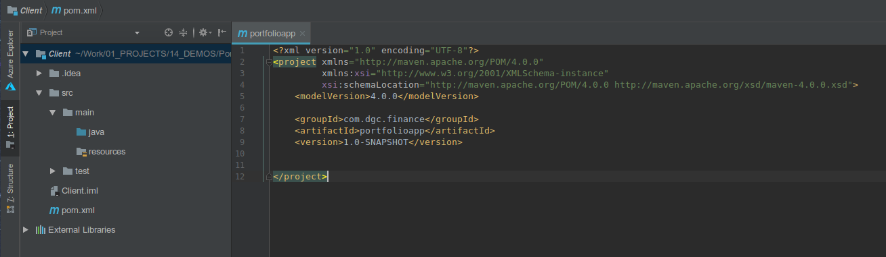

# Synopsis

Dans ce tutoriel, nous allons développer un client en JavaFX. A tire d'éxemple, nous dévelepperons un logiciel de gestion de portefeuille de titres financiers.

Vu le vaste sujet, nous découpons en plusieurs parties et abordons ici la mise en place de l'environnement de développement, les librairies utilisées et nous verrons l'affichage de la fenêtre principale.

[forumdvp][0]

# Développement d'un client pas si lourd avec JavaFX - partie 1

## Introduction

Il y a quelques années, on appelait les interfaces graphiques pour desktop des clients lourds, en opposition aux clients légers qui sont dans les navigateurs. Depuis les clients légers ont pour beaucoup pris énormément de poids et peuvent venir concurrencer ces vieux clients lourds en terme de consommation de ressources.

Voici quelques remarques que l'on peut rencontrer autour de la machine à café sur les clients lourds Java:

 * ils ne sont pas beau: c'est vrai que des fois les développeurs n'ont pas beaucoup investis sur le UI mais quand on voit un grand nombre de sites, on se rend compte que c'est également le cas pour le web. De plus avec JavaFX, vous pouvez styler facilement en css vos applis ce qui peut donner des interfaces sympa. Regardez les [démos de JFoenix](https://github.com/jfoenixadmin/JFoenix) par exemple.
 * ils doivent passer par des processus d'installation et de mises à jour. Un des avantages du web et de sa démocratisation est le déploiement sans intervention sur le poste utilisateur. Les applications basées sur [Electron](https://electronjs.org/) bénéficient également de cet apport mais il existe aussi des systèmes de bootstrap pour application Java ou autres langages.
 * ils sont lent et consomment énormément de ressources : ce genre de remarque peu objective se retrouve dans n'importe quel langage et très souvent cela dépend de son usage et non pas d'un défaut intrinsèque.
 * enfin, pour cloturer cette liste sur une note positive, le principal avantage d'un client Java est de bénéficier de l'écosytème très vaste du langage.


## Résumé
**Le code de l'application se trouve >>** [ dans notre repo ](https://github.com/Goovy/PortfolioApp/tree/part1) **<<** 

Dans cette première partie, nous allons voir:

  * initialisation du code : le main,
  * les ressources (images, css et i18n)
  * les logs
  * un gui d'application simple
  * un gui d'application plus sympa (enfin cela dépend des goûts et des couleurs)

## Environnement de développement et ses dépendances.

Il faut un environnement de développement Java avec un IDE (IntelliJ dans mon cas), git, maven. Le code présenté a été développé avec le JDK 8.211.

_Note : après Java 8, JavaFX a été sorti du JDK et fait parti d'un projet séparé :OpenJFX._

Nous utiliserons en plus les librairies/outils suivants:

* [scenebuilder](https://gluonhq.com/products/scene-builder/) : pour dessiner les écrans de l'application. _Je ne suis pas un grand fan de ces outils et je préfère éditer le code manuellement mais il permet de prototyper rapidement votre GUI._
* [scenicview](https://github.com/JonathanGiles/scenic-view) : permet la visualisation de l'arbre des composants graphique pendant le lancement de votre programme. _Cet outil est très utile pour le débuggage des composants graphiques et du css. C'est votre chrome dev tool pour JavaFX._
* [fxlauncher](https://github.com/edvin/fxlauncher) : un bootstrap d'application qui permet de mettre à jour automatiquement les clients au démarrage. _Il est relativement simple d'utilisation et fait le job mais il ralenti le démarrage._ 
* [mvvmfx](https://github.com/sialcasa/mvvmFX/) : un framework pour JavaFX. Il se rapproche du pattern MVVM de C#. _Je le trouve simple et efficace avec ce qu'il faut pour nos besoins actuels: séparation de la partie graphique dans les fichiers xml, de la vue et du controller (appelé model). Il apporte une injection de dépendances, un système de notification et d'évenements... Il existe [plein d'autres initiatives de frameworks](https://github.com/mhrimaz/AwesomeJavaFX)._


# Développement d'un outil de suivi de portefeuille financier.

## Les besoins
Pour partir sur un exemple concret, nous allons développer une application de gestion de portefeuille (très simplifiée).
Voici les stories que nous allons mettre en oeuvre:

- je veux pouvoir définir par quelques caractéristiques titre financier.
- je veux pouvoir acheter ou vendre ces titres à un prix et quantité fixé.
- je veux pouvoir calculer la plus ou moins value réalisée sur chacun des achats/ventes.

## Une première fenêtre
Dans votre IDE, créez un nouveau projet Maven vide.


Nous modifions le pom.xml pour ajouter la dépendance avec le framework [mvvmfx](https://github.com/sialcasa/mvvmFX/)
Vous obtenez le pom.xml suivant:


```Maven
    <properties>
        <project.build.sourceEncoding>UTF-8</project.build.sourceEncoding>
        <maven.compiler.source>1.8</maven.compiler.source>
        <maven.compiler.target>1.8</maven.compiler.target>
        <mvvmfx.version>1.7.0</mvvmfx.version>
        <guice.version>4.1.0</guice.version>
    </properties>

    <!-- use resource files (fxml, css) from the java directory -->
	<build>
		<resources>
			<resource>
				<directory>src/main/java</directory>
			</resource>
			<resource>
				<directory>src/main/resources</directory>
			</resource>
		</resources>
	</build>
    
    <dependencies>
    <!-- MVVM framework with CDI implementation -->
        <dependency>
            <groupId>de.saxsys</groupId>
            <artifactId>mvvmfx</artifactId>
            <version>${mvvmfx.version}</version>
        </dependency>
        <dependency>
            <groupId>de.saxsys</groupId>
            <artifactId>mvvmfx-guice</artifactId>
            <version>${mvvmfx.version}</version>
        </dependency>
    </dependencies>
```


Ajoutez ensuite une nouvelle classe qui sera le point d'entrée de l'application. Une application standard JavaFX hérite de  `javafx.application.Application`. 
Mais comme nous utilisons MVVMFX, vous devez la faire hériter de `MvvmfxGuiceApplication`. Pour cet exemple, nous utilisons Guice en tant qu'implémentation d'injection des dépendances mais ce n'est pas une obligation, comme [précisé dans la documentation](https://github.com/sialcasa/mvvmFX/wiki/Dependency-Injection).

Vous devez implémenter 3 méthodes qui sont assez parlantes: init, start et stop.


Nous complétons la méthode start pour afficher une fenêtre et obtenir un aperçu de notre dur labeur.


```Java
@Override
    public void startMvvmfx(Stage stage) throws Exception {
        stage.setTitle("Portefeuille très simplifié");

        // Chargement de la vue principale
        final ViewTuple<MainView, MainViewModel> main = FluentViewLoader.fxmlView(MainView.class).load();
        Scene rootScene = new Scene(main.getView());

        stage.setScene(rootScene);
        stage.show();
    }
```


et n'oubliez pas d'ajouter dans la méthode void main `launch(args);` qui lancera JavaFX.

Puis il faut créer les classes correspondantes à notre première fenêtre "main" que nous plaçons dans un folder "gui". 

__Du fait de l'utilisation de MVVMFX, les composants graphiques sont composés de 3 fichiers:__ 

 - __un fichier xml qui décrit l'interface graphique,__
 - __une classe de vue, aussi appelé "code behind" qui traite les événements graphiques,__
 - __une classe vue/model qui sert de lien entre les services métiers et le composant.__


Vous pouvez ajouter des snippets dans IntelliJ ou Eclipse pour aller plus vite [comme indiqué dans la documentation](https://github.com/sialcasa/mvvmFX/wiki/IDE-integration).

Nous ajoutons une classe **MainViewModel.java** vide comme nous n'avons pas de code métier actuellement:


```Java
import de.saxsys.mvvmfx.ViewModel;

public class MainViewModel implements ViewModel {
}
```


et une classe **MainView.java** vide également, avec le lien vers le controller (ViewModel) :


```
import de.saxsys.mvvmfx.FxmlView;
import de.saxsys.mvvmfx.InjectViewModel;

public class MainView implements FxmlView<MainViewModel> {

    @InjectViewModel
    private MainViewModel viewModel;

    public void initialize() {

    }
}
```


et enfin le fichier **MainView.fxml** avec une interface graphique très évoluée :


```Xml
<?xml version="1.0" encoding="UTF-8"?>

<?import javafx.scene.control.Label?>
<?import javafx.scene.layout.AnchorPane?>


<AnchorPane prefHeight="400.0" prefWidth="600.0" xmlns="http://javafx.com/javafx/8.0.121" xmlns:fx="http://javafx.com/fxml/1" fx:controller="MainView">
   <children>
      <Label text="Application de gestion de portefeuille" />
   </children>
</AnchorPane>
```


Voilà, vous pouvez déjà lancer l'application pour voir le magnifique écran avec votre label!!!

# Personalisation de l'interface

## Ajout des logs

Ajoutez les dépendances à slf4j dans le fichier pom.xml:

```
    <!-- SLF4J -->
    <dependency>
        <groupId>ch.qos.logback</groupId>
        <artifactId>logback-classic</artifactId>
        <version>1.2.3</version>
    </dependency>
```

et dans la classe `App.java`, ajoutez `private static final Logger LOG = LoggerFactory.getLogger(App.class);`  que vous pouvez utiliser dans la méthode start avec `LOG.debug("L'application démarre!");`.

Vous pouvez configurer le logger en ajoutant un fichier logback.xml dans le répertoire resources:


```
<?xml version="1.0" encoding="UTF-8"?>
<configuration>

    <appender name="STDOUT" class="ch.qos.logback.core.ConsoleAppender">
        <encoder>
            <pattern>%date [%thread] %-5level %logger - %msg%n</pattern>
        </encoder>
    </appender>

    <logger name="com.dgc.finance" level="TRACE"/>

    <root level="debug">
        <appender-ref ref="STDOUT" />
    </root>
</configuration>
```


## Ajout de ressources
Evitons d'hardcoder les chaînes de caractères comme nous venons de le faire et passons le tout dans des fichiers de ressources.

Nous ajoutons au passage une icone d'application et un lien vers un fichier CSS.
Pour la définition des styles, n'hésitez pas à [consulter le guide de références](https://docs.oracle.com/javase/8/javafx/api/javafx/scene/doc-files/cssref.html) pour connaitre les instructions CSS disponibles.

La méthode start devient:


```Java
@Override
    public void startMvvmfx(Stage stage) throws Exception {
        LOG.debug("L'application démarre!");

        // Ajout du paquet de resources par defaut pour l'i18n
        ResourceBundle resourceBundle = ResourceBundle.getBundle("default");
        MvvmFX.setGlobalResourceBundle(resourceBundle);
        stage.setTitle(resourceBundle.getString("window.title"));

        // Ajout d'une icone d'application
        stage.getIcons().add(new Image(getClass().getResourceAsStream("/appIcon.png")));

        // Chargement de la vue principale
        final ViewTuple<MainView, MainViewModel> main = FluentViewLoader.fxmlView(MainView.class).load();
        Scene rootScene = new Scene(main.getView());

        // Ajout d'une feuille de style
        rootScene.getStylesheets().add("/main.css");

        stage.setScene(rootScene);
        stage.show();
    }
```


et nous ajoutons une feuille de style dans les ressources avec le fichier **main.css**:


```
/* Main css file */
.label {
    -fx-font-family: "Courier New";
    -fx-font-size: 12px;
    -fx-text-fill: crimson;
    -fx-background-color: aquamarine;
}
```


et pour utiliser les resources textes dans le fichier fxml, utilisez "%" devant la clé: `<Label text="%text.intro" />`.

Voici l'arborescence des fichiers obtenue :


## Un GUI d'application simple et classique

Pour dessiner le GUI, nous allons personnaliser le MainView.fxml à l'aide de [scene-builder](http://gluonhq.com/products/scene-builder/). Celui-ci peut-être lancé dans l'IDE ou bien séparemment.
Nous remplaçons la balise `AnchorPane` par un `BorderPane` qui découpe de façon classique l'interface main et utilisons les instructions `<fx:include ...>` pour le composant menu et sous-menu.

Le MainView.fxml devient:


```
<BorderPane prefHeight="600.0" prefWidth="800.0" xmlns="http://javafx.com/javafx/8.0.121" xmlns:fx="http://javafx.com/fxml/1" fx:controller="gui.main.MainView">
    <!-- Barre de menu -->
    <top>
        <fx:include source="../menu/MenuView.fxml" />
    </top>
    <!-- Sous-menu de navigation -->
    <left>
        <fx:include source="../navigation/NavigationView.fxml" />
    </left>
    <!-- Contenu principale -->
    <center>
        <TabPane prefHeight="200.0" prefWidth="200.0" tabClosingPolicy="UNAVAILABLE" BorderPane.alignment="CENTER">
            <tabs>
                <Tab text="Untitled Tab 1">
                    <content>
                        <AnchorPane minHeight="0.0" minWidth="0.0" prefHeight="180.0" prefWidth="200.0">
                            <children>

                            </children>
                        </AnchorPane>
                    </content>
                </Tab>
                <Tab text="Untitled Tab 2">
                    <content>
                        <AnchorPane minHeight="0.0" minWidth="0.0" prefHeight="180.0" prefWidth="200.0">
                            <children>

                            </children>
                        </AnchorPane>
                    </content>
                </Tab>
            </tabs>
        </TabPane>
    </center>
    <!-- Barre de notification -->
    <bottom>
        <HBox id="HBox" alignment="CENTER_LEFT" spacing="5.0" BorderPane.alignment="CENTER">
            <children>
                <Label maxHeight="1.7976931348623157E308" maxWidth="-1.0" text="This is the left side." HBox.hgrow="ALWAYS">
                    <font>
                        <Font size="11.0" fx:id="x3" />
                    </font>
                    <textFill>
                        <Color blue="0.625" green="0.625" red="0.625" fx:id="x4" />
                    </textFill>
                </Label>
                <Pane prefHeight="-1.0" prefWidth="-1.0" HBox.hgrow="ALWAYS" />
                <Label font="$x3" maxWidth="-1.0" text="This is the right side." textFill="$x4" HBox.hgrow="NEVER" />
            </children>
            <padding>
                <Insets bottom="3.0" left="3.0" right="3.0" top="3.0" />
            </padding>
        </HBox>
    </bottom>
</BorderPane>
```

Créez les 3 fichiers (Vue, VueModèle et xml) pour le menu et le sous-menu.
Le fichier **MenuView.fxml** contient la description du menu et de ses entrées :


```
<AnchorPane maxHeight="-Infinity" maxWidth="+Infinity" minHeight="-Infinity" minWidth="-Infinity"
            xmlns="http://javafx.com/javafx"
            xmlns:fx="http://javafx.com/fxml"
            fx:controller="gui.menu.MenuView">

    <children>
        <MenuBar AnchorPane.bottomAnchor="0.0" AnchorPane.leftAnchor="0.0" AnchorPane.rightAnchor="0.0"
                 AnchorPane.topAnchor="0.0">
            <menus>
                <Menu mnemonicParsing="false" text="%menu.file">
                    <items>
                        <MenuItem mnemonicParsing="false" text="%menu.quit" onAction="#quit" />
                    </items>
                </Menu>
                <Menu mnemonicParsing="false" text="%menu.help">
                    <items>
                        <MenuItem mnemonicParsing="false" onAction="#about" text="%menu.about" />
                    </items>
                </Menu>
            </menus>
        </MenuBar>
    </children>
</AnchorPane>
```


et le "code-behind" MenuView.java récupère le stage principale pour pouvoir le fermer par l'action définit dans le fichier xml avec l'attribut `onAction` et un # suivi du nom de la méthode.


```Java
public class MenuView implements FxmlView<MenuViewModel> {

    @InjectViewModel
    private MenuViewModel viewModel;

    @Inject
    Stage primaryStage;

    public void initialize() {

    }

    public void quit(ActionEvent actionEvent) {
        primaryStage.close();
    }

    public void about(ActionEvent actionEvent) {
    }
}
```


## Un GUI propre et moderne (Material UI)

Notre interface graphique est simple et efficace mais son look ne fait pas trop moderne. Nous allons le changer pour appliquer les principes de [material design](https://material.io/design/) définis par les équipe de Google.

Pour cela, nous allons utiliser la librairie Java [JFoeniX](http://www.jfoenix.com/) à inclure dans le **pom.xml**:


```
<dependency>
    <groupId>com.jfoenix</groupId>
    <artifactId>jfoenix</artifactId>
    <version>8.0.4</version>
</dependency>
```

## Fenetre principale

Nous ajoutons les CSS et polices de caractères propres au material design:


Au début du fichier **material-ui.css**, nous ajoutons le chargement des fonts avec


```
@import url("jfoenix-fonts.css");

.root {
    -fx-font-family: "Roboto";
}
```


et nous modifions le fichier **App.java** pour utiliser le `JFXDecorator` et charger les feuilles de style:


```Java
    // Chargement de la vue principale
    final ViewTuple<MainView, MainViewModel> main = FluentViewLoader.fxmlView(MainView.class).load();
    JFXDecorator jfxDecorator = new JFXDecorator(stage, main.getView());
    // pour ne pas cacher la barre de tache windows quand maximisé
    jfxDecorator.setCustomMaximize(true);
    // pour ajouter une icone à gauche du titre. Le SVG est défini en css par l'atttribut --fx-shape.
    jfxDecorator.setGraphic(new SVGGlyph());
    Scene rootScene = new Scene(jfxDecorator);

    // Ajout d'une feuille de style
    rootScene.getStylesheets().add("/css/material-ui.css");
    rootScene.getStylesheets().add("/css/main.css");
```

## Le menu et sous menu

Pour le menu, nous reprenons le principe des applications basées sur [electron](https://electronjs.org/docs/tutorial/about) qui est de cacher la barre de menu disgracieuse par défaut et de l'afficher avec le bouton "Alt" (pas testé sous Mac).

Nous commençons par créer un material menu avec la partie menu bar classique et la partie toolbar de la librairie JFoeniX. Voici la vue **MenuView.fxml**


```
<AnchorPane maxHeight="-Infinity" maxWidth="+Infinity" minHeight="-Infinity" minWidth="-Infinity"
            xmlns="http://javafx.com/javafx/8.0.121"
            xmlns:fx="http://javafx.com/fxml/1"
            fx:controller="gui.material_menu.MenuView">
   <children>
      <VBox AnchorPane.bottomAnchor="0.0" AnchorPane.leftAnchor="0.0" AnchorPane.rightAnchor="0.0" AnchorPane.topAnchor="0.0"
            fx:id="menuPane">
         <children>
            <!-- Keep the menubar like in Electron -->
            <MenuBar fx:id="menuBar">
               <menus>
                  <Menu mnemonicParsing="false" text="%menu.file">
                     <items>
                        <MenuItem mnemonicParsing="false" text="%menu.quit" onAction="#quit" />
                     </items>
                  </Menu>
                  <Menu mnemonicParsing="false" text="%menu.help">
                     <items>
                        <MenuItem mnemonicParsing="false" onAction="#about" text="%menu.about" />
                     </items>
                  </Menu>
               </menus>
            </MenuBar>
            <!-- Add the material top bar -->
            <JFXToolbar>
               <leftItems>
                  <JFXRippler maskType="CIRCLE" style="-fx-ripple-color:WHITE;">
                     <StackPane fx:id="titleBurgerContainer">
                        <JFXHamburger fx:id="titleBurger">
                           <HamburgerSlideCloseTransition/>
                        </JFXHamburger>
                     </StackPane>
                  </JFXRippler>
                  <Label text="%section.title.dashboard"></Label>
               </leftItems>
            </JFXToolbar>

         </children>
      </VBox>
   </children>
</AnchorPane>
```


Pour afficher et cacher le menu, nous allons utiliser la librairie [jnativehook](https://github.com/kwhat/jnativehook) en ajoutant la dépendance dans notre **pom.xml** :


```
<dependency>
    <groupId>com.1stleg</groupId>
    <artifactId>jnativehook</artifactId>
    <version>RELEASE</version>
</dependency>
```

Nous créons un listener qui implémente cette librairie et qui va notifier une partie de l'application que la touche Alt a été pressée.


```Java
public class KeyListener implements NativeKeyListener {

    public KeyListener() { }

    @Override
    public void nativeKeyTyped(NativeKeyEvent nativeKeyEvent) { }

    @Override
    public void nativeKeyPressed(NativeKeyEvent nativeKeyEvent) {
        if (nativeKeyEvent.getKeyCode()==NativeKeyEvent.VC_ALT) {
            App.getKeyEventBus().post("AltKeyPressed");
        }
    }

    @Override
    public void nativeKeyReleased(NativeKeyEvent nativeKeyEvent) { }
}
```

Pour la notification, nous utilisons l'event bus de [Guava](https://github.com/google/guava/wiki/EventBusExplained). Nous modifions donc notre class `App` en ajoutant l'initialisation de l'event bus:


```Java
    // EventBus using Guava
    private static EventBus eventBus = new EventBus("Key_Pressed_event_bus");

    public static EventBus getKeyEventBus() {
        return eventBus;
    }
```

Puis dans notre ViewModel du menu nous écoutons le bus pour ces messages et nous informons la vue d'afficher/cacher la barre de menu via le mécanisme de notifications de mvvmfx. 
Nous reviendrons dans une seconde partie sur les mécanismes de notifications internes apportés par MVVMFX.


```Java
public class MenuViewModel implements ViewModel {
    private static final Logger LOG = LoggerFactory.getLogger(MenuViewModel.class);

    public static final String SHOW_HIDE_MENU = "ShowHide_Navigation_Menu";

    public void initialize() {
        // On souscrit aux notifications de la touche Alt
        App.getKeyEventBus().register(this);
    }

    @Subscribe
    public void altKeyPressedEvent(String event) {
        if (event.equals("AltKeyPressed")) {
            LOG.debug("Received event Alt key pressed");
            publish(SHOW_HIDE_MENU);
        }
    }
}
```

Nous complétons la vue **MenuView.java** pour traiter l'evenement provenant du controller:
```Java
    private boolean isMenuShowed = false;

    public void initialize() {
        // par défaut le menu est caché et il est affiché en appuyant sur la touche Alt
        hideMenuBar();
        viewModel.subscribe(MenuViewModel.SHOW_HIDE_MENU, (k, v) -> showHideMenuBar());
    }

    private void showHideMenuBar() {
        if (isMenuShowed) {
            hideMenuBar();
        } else {
            showMenuBar();
        }
    }

    private void showMenuBar() {
        menuPane.getChildren().add(0, menuBar);
        isMenuShowed = true;
    }

    private void hideMenuBar() {
        menuPane.getChildren().remove(menuBar);
        isMenuShowed = false;
    }
```

## Hamburger du menu

Nous implémentons maintenant l'affichage de la sous-navigation dans un paneau rétractable à gauche en appuyant sur l'icone avec les 3 barres horizontales (hamburger).

Nous ajoutons le click sur le hamburger dans le fichier **MenuView.fxml** `<StackPane fx:id="titleBurgerContainer" styleClass="hamburger-icon" onMouseClicked="#hamburgerClicked">`.
Dans la vue, nous notifions simplement le controller 


```Java
    public void hamburgerClicked(MouseEvent mouseEvent) {
        viewModel.notifyShowHideSidePane();
    }
```

et dans le controller, nous notifions via une notification par scope du framework mvvmfx, le Main controller (sous oublier d'injecter le scope) `public void notifyShowHideSidePane() { menuScope.publish(MenuScope.SIDE_PANE); }`.

Le MenuScope est une simple classe qui hérite de `Scope` et qui contient seulement une constante pour identifier l'événement. Vous pouvez passer dans le corps du message plus d'informations/objets et nous verrons cela dans un second tutoriel.


```Java
public class MenuScope implements Scope {
    public static final String SIDE_PANE = "SIDE_PANE";
}
```


Dans le controller principal, nous ajoutons une souscription à ce scope et nous informons la vue d'actionner le sous-menu.


```Java
@ScopeProvider(scopes = {MenuScope.class})
public class MainViewModel implements ViewModel {
    public static final String SIDE_PANE = "Show/Hide side pane";

    @InjectScope
    MenuScope menuScope;

    public void initialize() {
        menuScope.subscribe(MenuScope.SIDE_PANE, (k,v) -> publish(SIDE_PANE));
    }
}
```


Dans la vue principale **MainView.java** nous ajoutons la souscription à l'événement du controller et l'initialisation des vues à afficher.


```Java
public class MainView implements FxmlView<MainViewModel> {

    public JFXDrawer drawer;

    @InjectViewModel
    private MainViewModel viewModel;

    public void initialize() {
        final ViewTuple navigationView = FluentViewLoader.fxmlView(NavigationView.class).load();
        drawer.setSidePane(navigationView.getView());
        drawer.setOverLayVisible(false);
        viewModel.subscribe(MainViewModel.SIDE_PANE, (k,v) -> openCloseSidePane());
        // Affichage du conteneur qui contient le contenu ou aussi appelé contenant
        final ViewTuple contentView = FluentViewLoader.fxmlView(ContentView.class).load();
        drawer.setContent(contentView.getView());
    }

    private void openCloseSidePane() {
        if (drawer.isClosed() || drawer.isClosing()) {
            drawer.open();
        } else {
            drawer.close();
        }
    }
}
```


et le fichier XML de la vue a été simplifié


```
[...]
    <!-- Barre de menu -->
   <top>
      <fx:include source="../material_menu/MenuView.fxml" />
   </top>
   <!-- Contenu principal -->
   <center>
      <JFXDrawer fx:id="drawer" defaultDrawerSize="180" direction="LEFT" styleClass="body">
      </JFXDrawer>
   </center>
[...]
```

# Conclusion partie 1

A ce stade, vous devriez avoir une application qui ressemble à ceci (sinon récupérez la du [repo](https://github.com/Goovy/PortfolioApp/tree/part1)).
Par contre les stories n'ont pas été répondues. Il s'agissait du sprint 1 de mise en place de l'architecture technique.


## Remerciements

D'abord j'adresse mes remerciements aux équipes derrière MVVMFX et les autres librairies utilisées et aussi à GluonHQ qui reprend le flambeau de JavaFX après son abandon par Oracle. Je n'oublie pas tous les contributeurs qui participent.

Plus spécifiquement en ce qui concerne cet article, je tiens à remercier mon binome de toujours [Denis Garcia](https://www.kiadra.com/), l'équipe de Developpez.com et plus particulièrement [Mickael Baron](http://www.developpez.net/forums/u69211/mickael-baron/) pour son aide et accompagnement.
